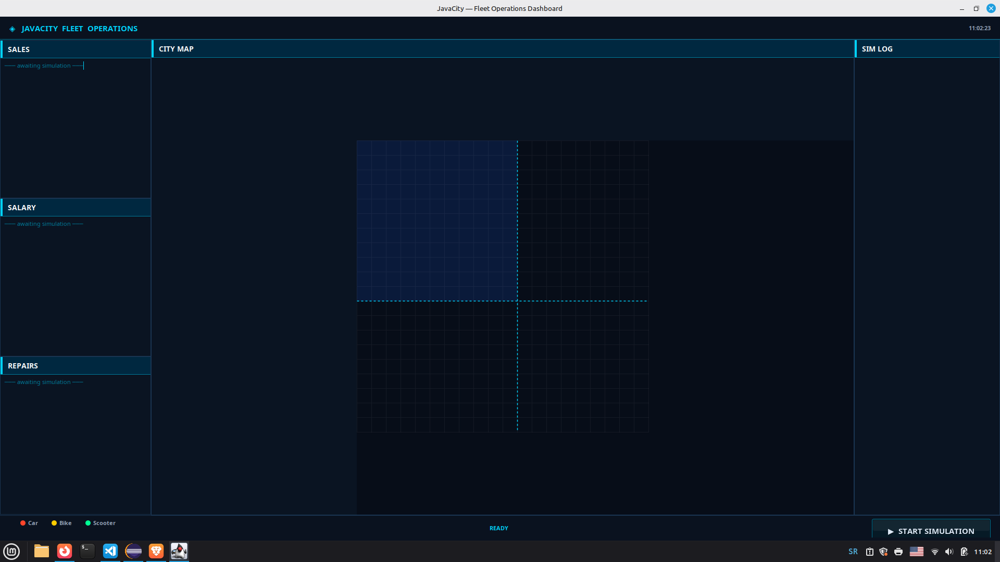
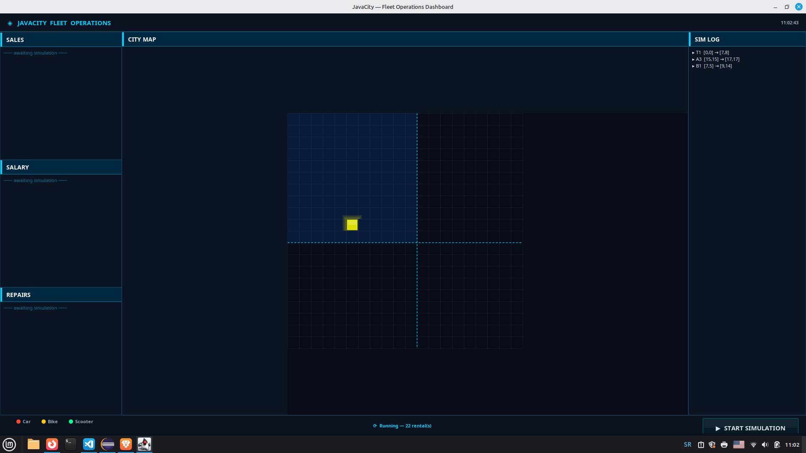
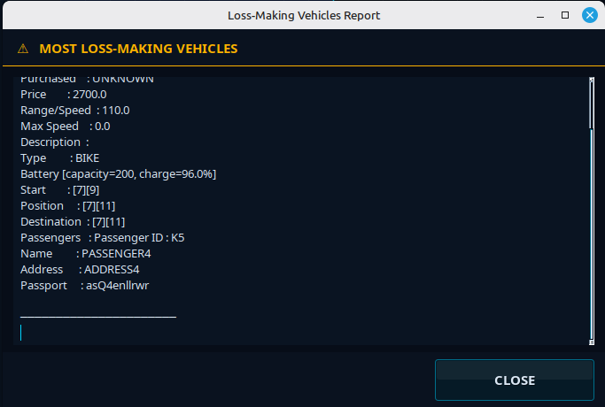

# ePJ2 — JavaCity Fleet Operations Dashboard

ePJ2 is an electric vehicle rental simulation system for the fictional city of **JavaCity**.  
It manages a fleet of cars, bikes, and scooters across a real-time 20×20 city grid, calculates rental fares, tracks malfunctions, and produces financial reports — all through a dark tactical HUD-style GUI built with Java Swing.

---

## 🖥️ Screenshots

### Main Dashboard — Idle
> The dashboard on startup, before a simulation is launched.



---

### Simulation Running
> Vehicles moving across the city grid in real time. Green = Scooter, Red = Car, Yellow = Bike.  
> The SIM LOG panel on the right streams dispatch events live.



---

### After Simulation — Monitors Updated
> Sales, Salary, and Repair monitors filled with results after the simulation completes.



---

## 🚀 How to Run (Eclipse IDE)

> **Recommended environment: Eclipse IDE for Java Developers**

### Step 1 — Import the project
1. Open Eclipse.
2. Go to **File → Import → Existing Projects into Workspace**.
3. Select the root folder of the repository and click **Finish**.

### Step 2 — Ensure the CSV data files are in the project root
Place the following files directly in the **project root** (same level as `src/`):

```
PJ2 - projektni zadatak 2024 - Prevozna sredstva.csv    ← vehicle data
PJ2 - projektni zadatak 2024 - Iznajmljivanja.csv        ← rental data
```

### Step 3 — Run the application
1. In the **Package Explorer**, expand `src → gui`.
2. Right-click `MainWindow.java`.
3. Select **Run As → Java Application**.
4. The dashboard window will open.

### Step 4 — Start the simulation
Click the **▶ START SIMULATION** button in the bottom-right corner of the dashboard.  
The simulation will:
- Load all vehicles and rentals from the CSV files.
- Dispatch each vehicle as a separate thread.
- Animate vehicle movement live on the city map.
- Stream log events to the SIM LOG panel.
- Fill the SALES, SALARY, and REPAIRS monitors when done.
- Open a popup showing the most loss-making vehicle type.

---

## 📋 Project Overview

The system tracks three types of electric vehicles:

| Type | Battery | Map Colour |
|------|---------|------------|
| Car | 300 units | 🔴 Red |
| Bike | 200 units | 🟡 Yellow |
| Scooter | 100 units | 🟢 Green |

Each vehicle is a **Java thread** — it moves step-by-step across the 20×20 grid, drains its battery per step, and generates a **Bill** for its passenger on arrival.

---

## 🛠️ Features

### 1 — Vehicle Management
- Three vehicle subclasses: `Car`, `Bike`, `Scooter` (extend abstract `Vehicle extends Thread`).
- `VehicleType` enum replaces all raw type strings (`"automobil"`, `"bicikl"`, `"trotinet"`).
- Each vehicle exposes a `getMapColor()` method — the map panel uses polymorphism to colour cells with zero `instanceof` checks.
- Battery charges and discharges per movement step; two bugs in the original `Battery` class were fixed during refactoring.

### 2 — Rental System
- Rentals are loaded from a CSV file, validated, deduplicated, and sorted chronologically.
- Fare calculation accounts for: base unit price per vehicle type, wide/narrow city zone multiplier, every-10th-rental promotional discount, and malfunction waiver.
- Passengers are randomly assigned as `Local` (national ID) or `Stranger` (passport).
- A `Bill` is generated and attached to each passenger at trip end.

### 3 — Real-Time Simulation
- Each vehicle runs on its own `Thread`.
- The city grid is a `20×20` array of `Object` cells protected by per-cell `ReentrantLock`s.
- The map repaints at ~30 fps via a Swing `Timer`.
- Vehicle movement is logged live in the SIM LOG panel.

### 4 — Financial Reports (Monitors)
Three monitors update automatically after the simulation ends:

| Monitor | Tracks |
|---------|--------|
| **SALES** | Number of rentals per vehicle type |
| **SALARY** | Total revenue, discount revenue, promotion revenue |
| **REPAIRS** | Repair costs per vehicle type (7% / 4% / 2% of purchase price) |

The most loss-making vehicle type is serialized to `Reports/MostLossMakingVehicles.ser` and deserialized into a popup window.

---

## 🎨 GUI Design

The interface follows a **dark tactical HUD** aesthetic — think mission control for a smart city.

| Element | Description |
|---------|-------------|
| Title bar | App name in electric cyan + live `HH:mm:ss` clock |
| SALES / SALARY / REPAIRS panels | Left column, stacked flush, each with a titled header strip |
| CITY MAP | Centre panel — dark grid, glowing vehicle cells, dashed zone boundary |
| SIM LOG | Right panel — live scrolling dispatch log |
| Bottom bar | Vehicle legend, status text, glowing START button |

All design tokens (colours, fonts) live in `AppTheme.java`. Changing one value propagates everywhere.

---

## 📁 Project Structure

```
ePJ2/
│
├── src/
│   ├── battery/          Battery, BatteryException
│   ├── bill/             Bill
│   ├── data/             VehicleDataLoader, RentalDataLoader
│   ├── gui/              MainWindow, MapPanel, AppTheme, GlowButton,
│   │                     LossMakingVehiclesWindow
│   ├── javacitymap/      JavaCityMap, JavaCityMapException
│   ├── malfunction/      Malfunction
│   ├── model/            Vehicle (abstract), Car, Bike, Scooter, VehicleType
│   ├── monitor/          RentalSalesMonitor, RentalSalaryMonitor,
│   │                     RentalRepairCostsMonitor
│   ├── passenger/        Passenger (abstract), Local, Stranger
│   ├── rental/           Rental
│   └── utility/          ConfigFileCreator, ConfigFileReader,
│                         Serializer, Deserializer, RandomStringGenerator
│
├── Reports/              Serialized binary output (auto-created at runtime)
├── config.properties     Auto-generated pricing config
├── PJ2 - projektni zadatak 2024 - Prevozna sredstva.csv
├── PJ2 - projektni zadatak 2024 - Iznajmljivanja.csv
└── README.md
```

---

## 🔧 Key Refactoring Changes

This project was significantly refactored from the original submission. Notable improvements:

- **`VehicleType` enum** — eliminates all raw Bosnian string literals scattered across six files.
- **Bug fix: `Battery.charge()`** — original code always added 100 instead of the `amount` argument.
- **Bug fix: `Battery.setChargeLevel()`** — original guard condition `0 < status && status >= 100` was logically impossible (nothing could satisfy it).
- **Thread-safe monitors** — `AtomicLong` / `DoubleAdder` replace plain `static double` fields.
- **`getMapColor()` polymorphism** — `MapPanel` has no `instanceof` chain; each vehicle subclass declares its own colour.
- **Billing extracted** — fare calculation moved out of `Vehicle.run()` into a dedicated `generateBill()` method.
- **Deleted dead code** — `proba/` package (commented-out scratch tests) and duplicate `user/` package removed entirely.
- **All identifiers translated to English** — no Bosnian/Serbian variable or method names remain in the codebase.

---

## 📑 Configuration

`config.properties` is auto-created on first run by `ConfigFileCreator`. Default values:

```properties
CAR_UNIT_PRICE     = 0.05
BIKE_UNIT_PRICE    = 0.02
SCOOTER_UNIT_PRICE = 0.01
DISTANCE_WIDE      = 1.5
DISTANCE_NARROW    = 1.0
DISCOUNT           = 0.1
DISCOUNT_PROM      = 0.05
```

---

## 💡 Best Practices Applied

- Full **JavaDoc** on all public classes and methods.
- **Packages** for every logical layer.
- **Single Responsibility** — data loading, simulation, billing, and monitoring are separate concerns.
- **`ReentrantLock`** per grid cell for fine-grained thread safety.
- **`Collections.synchronizedList`** for shared vehicle lists in monitors.

---

## 🛡️ License

Developed as part of the **Programski jezici 2** course at  
**Elektrotehnički fakultet, Banja Luka**.

---

## 👥 Contributors

- **Andrej Trožić** — Student, Elektrotehnički fakultet Banja Luka
